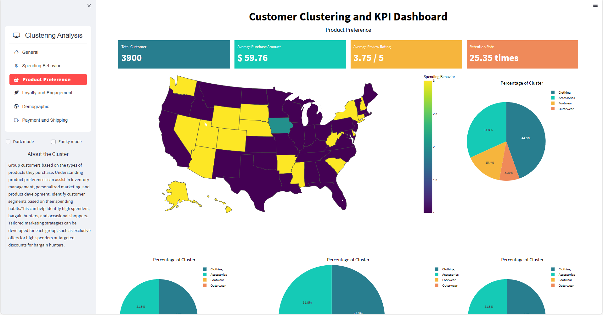

# Customer Segmentation Dashboard

This project is an interactive dashboard that offers a deeper understanding of customer behavior and Key Performance Indicator (KPI) analysis based on customer data. It helps pinpoint customer segments, uncover trends, and gain invaluable insights into how customers engage with your business.

## Large Language Model (LLM)

This project utilizes a pre-trained large language model (LLM) to extract meaningful insights and relationships from the customer data. The LLM has been fine-tuned on a specific dataset to improve its understanding of customer behavior and preferences.

### Model Architecture

The LLM is based on the [Transformer architecture](https://arxiv.org/abs/1706.03762) with [BERT-like embeddings](https://arxiv.org/abs/1810.04805). It has been trained on a large corpus of text data to develop a strong understanding of language structures and semantics.

### Fine-tuning

The LLM has been fine-tuned on a customer dataset to adapt its general language understanding capabilities to the specific context of customer behavior and preferences. This fine-tuning process involves training the model on the customer dataset for several epochs to minimize the loss function and improve the model's performance.

### Usage in the Dashboard

The LLM is used to analyze customer data and extract meaningful insights. These insights are then visualized in the dashboard using interactive visualizations, allowing users to explore and compare customer segments.

## Features

- Customer clustering based on various factors such as spending behavior, product preference, loyalty, engagement, demographics, and payment & shipping preferences
- Interactive visualizations to explore and compare customer segments
- Customizable themes: dark mode and funky mode
- Discussion about the data using Multimodal LLM

## Getting Started

To run the project, follow these steps:

1. Clone the repository: 
bash git clone https://github.com/username/customer-segmentation-dashboard.git
2. Navigate to the project directory:
bash cd customer-segmentation-dashboard
3. Install the required packages:
bash pip install -r requirements.txt
4. Run the application:
bash streamlit run app.py

## Usage

1. Select a cluster to analyze from the sidebar.
2. Explore the interactive visualizations to understand the cluster's characteristics.
3. Customize the theme to your preference.

## Dependencies

- Python 3.7+
- NumPy
- Pandas
- Streamlit
- Plotly
- openai

## Contributing

We welcome contributions! Please submit a pull request with your proposed changes.

## Authors and Acknowledgment

- [Masdar](https://www.linkedin.com/in/muhammad-masdar-mahasin-66914378/)
- by Masdar's Personal Project (https://mahaseenlab.com/)
